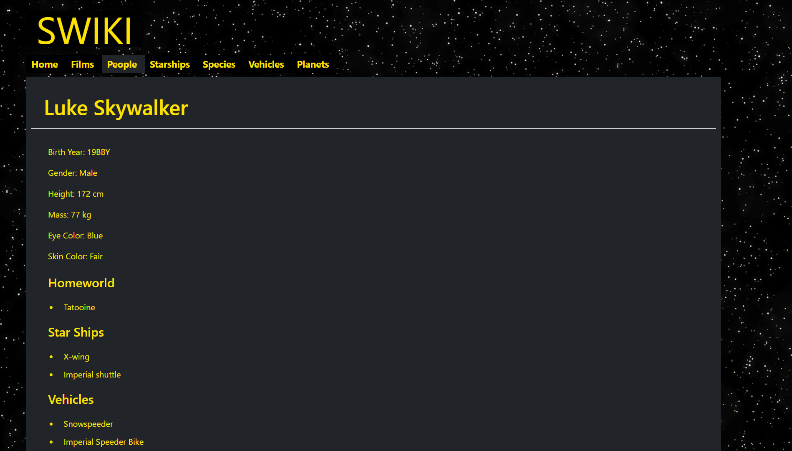

# SWIKI

A simple Star Wars Wiki built based on [SWAPI](https://swapi.dev/), the Star Wars API. The web app was developed using Vite, Vue, Sass, and Bootstrap.



## Live Demo on GitHub Pages
[Click Here](https://yilikaloufoua.github.io/star-wars-wiki/)

## Project Setup

```
# clone repository
git clone https://github.com/YilikaLoufoua/star-wars-wiki

# open project folder
cd star-wars-wiki

# install dependencies
npm install

# start local server 
npm run dev

# go to http://localhost:3000/star-wars-wiki/
```

## License

This project is licensed under the MIT License - see the LICENSE.md file for details
